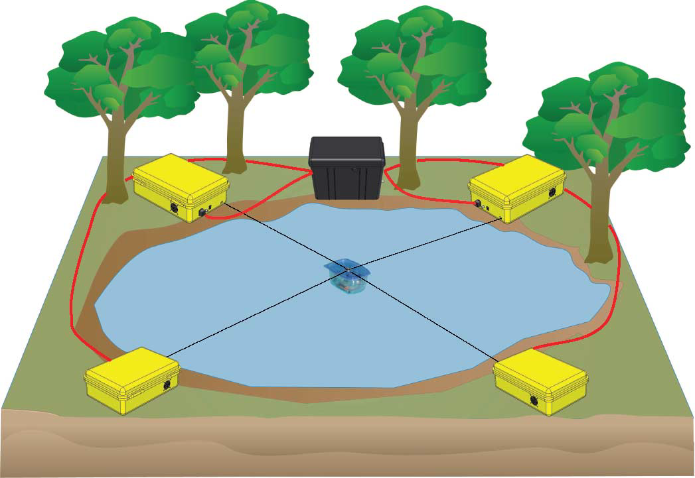

Calibration
===========
Overview
--------

Roboy 1.0 currently needs two people and a lot of time to get initialized and calibrated. The motors/muscles only give relative positions, which makes it impossible for Roboy to know where his spine, arms, etc are without further information. Roboy 2.0 shall be able to move to the initial position by himself, or at least faster and with less help than right now.

Requirements
~~~~~~~~~~~~

**Error detection:**
If a robot moves automatically to the initial position, it might hurt himself by doing so. Therfore it is essential that errors are detected and reported to the system, as the robot might get damaged otherwise. This detection can be realized through the evaluation of sensor data.

**Collision prediction:**
Prediction through motor states, expected and actual joint angles

**Motor states:**
This information is given from Middleware/Simulation

**Sensor states:**
This information is given from Middleware/Simulation

**Motor commands:**
The commands for steering Roboy are using ROS to communicate with Middleware or Simulation

Calibration
~~~~~~~~~~~

.. image:: images/sensors_PerfectSensor.png

Calibration is the comparision of measured and actual/standartized parameters, the most important characteristics are precision and resolution.

Precision is defined by the variation of its output for the same input, resolution shows the detection of small changes in the measured parameter.

Approaches
----------

Measuring Tension Changes
~~~~~~~~~~~~~~~~~~~~~~~~~

The tension in all motors changes while one is changing tension: This system is developed for a robot with only 2DoF, which is connected to four Motors (see picture). The position is determined by changing the tension in one motor. Changes of tension in the other three directions are measured and allow to calculate the current position of the robot.

Measuring Force/Torque
~~~~~~~~~~~~~~~~~~~~~~

Sensors are installed between the different parts of the body (i.e. spine). During initialization, the motor increases its tension until the sensor reports a certain position. This gives the absolute position.

Motion Capture
~~~~~~~~~~~~~~

Stereo-vision motion capture systems can provide joint angle data in real-time. The chair of Robotics at TUM developed this system in order to calibrate a torso-robot with spine, arms,...
The elbow joint was calibrated via few steady-state poses that had a great variety in the joint movements, while the shoulder was kept still. Motion capture can compensate the lack of joint angle sensors.

The paper "Calibration of a Physics-Based Model of an Anthropomimetic Robot using Evolution Strategies" presents an automoted steady-state pose calibration of an anthropomimetic robot model. Goal of the work is to reduce the gap between simulation and reality to a minimum. The lack of joint angle data in the robot is compensated by a motion capture system using stereo-vision infrared-markers in order to obtain the required input data. (Link to the paper is on `Confluence <https://devanthro.atlassian.net/wiki/spaces/CO/pages/75141912/Calibration+with+Motion+Capture>`_)

This joint angle measurement with motion capture technique might help to calibrate Roboy 1.0, as this robot does not have sensors for an internal tracking. (We can use external tracking because there is a lighthouse tracking system available).

They used two cameras with infrared pass filters and spherical, retro-reflective markers attached to the robot limts, which are illuminated by infrared LED clusters positioned next to the cameras.

Regarding the muscle model, no collisions between the muscles and sceleton are simulated. The muscle attachment points are approximated based on laser-scan-data and muscles are simulated as direct connection between two attachment points.

Each pose was aquired five times to compute the mean and standard deviation of the joint angles, because anthropomimetic robots to not provide the repeatability of industrial manipulators.

Sources
-------

https://learn.adafruit.com/calibrating-sensors/why-calibrate

https://en.wikipedia.org/wiki/Calibration

S. Wittmeier, A. Gaschler, M. Jantsch, K. Dalamagkidis and A. Knoll. "Calibration of a Physics-Based Model of an Anthropomimetic Robot using Evolution Strategies", 2012, IEEE/RSJ International Conference on Intelligent Robots and Systems

P. H. Borgstrom, B. L. Jordan, B. J. Borgstrom, M. J. Stealey, G. S. Sukhatme, M. A. Batalin and W. J. Kaiser. "NIMS-PL: A Cable-Driven Robot With Self-Calibration Capabilities", 2009, IEEE Transactions on Robotics, Vol. 25, No. 5, October 2009

