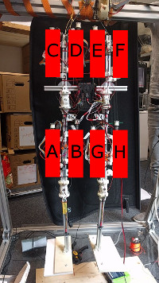

Internal Calibration Procedure
==============================

Goal
----

The PaBiLegs shall be put into an initial pose during the calibration procedure. All eight motors shall each be assigned to their position on the robot and tightended in order to hold the initial pose. Their positions will be saved in the code, so that further programs can address a motor position and don't have to care about its slot number on the FPGA.

This picture shows a possible order for the motor positions. The corresponding slot number can be saved i.e. in an array. One would then only have to address the array[0] for motor A, array[1] for motor B,...

Current Approach
----------------

The roboy-ros-control code goes through the following system states:

- **WaitForInitialize** motors are initialized via command line 
- **ResetPowerlinkStack** resets Powerlink Stack
- **Controlloop** waits for input via command line and moves the motors accordingly

A fourth state **Calibration** is added between ResetPowerlinkStack and Controlloop. This will calibrate the robot within the setup procedure.

For the calibration procedure, the robot should hang on the frame without touching the floor. This reduces external factors, that might complicate measurements. In the beginning it is best to tighten each motor until there is a little spring displacement noticeable, as force changes can only be detected properly when each sensor has valid values to begin with.

Following up to that, a single motor shall increase its force. The joint with the highest angle difference will be connected to that motor and the program can save this gained information. The force changes of the other motor springs might also give a hint on the second motor of the pair.
This can be repeated for all motors.

Now, the amount of possible positions for each motor is reduced to two. As the forces change on all motors when one part of the robot is moved, one can determine whether a motor is on the inner or outer side of a joint.
Here it might help to play around a little with the GUI of the myoFPGA-code: The diagrams show all force changes and joint displacements. Depending on which motor is moved, the force on the other motors in- or decreases in a regular pattern.

After assigning the motor positions, the robot has to move into its initial pose. In order to figure out the current absolute position of a robot part, it has to be moved to its limit. Two motors need to be steered for this, as each robot part is moved by two motors. With the discovered limits, each robot part can enter its predefined relative position and the robot is ready for further use.

Code structure
--------------

The roboy-ros-control repository consists of many submodules. Some of them - like the ``roboy_simulation`` or ``roboy_models`` repositories - aren't needed for our case, but it's better to leave them where they are.

The class, which contains the code, is called "roboy.cpp" with the corresponding header "roboy.hpp". Both files are part of the ``roboy_managing_node`` repository and can be found in the folders /include and /src.
"roboy.cpp" uses methods from the controller classes, which can be found in the ``roboy_controller`` repository. These classes don't need to be changed, but they might help you to understand how things work. As we need to work with the force/spring displacement of the motors, please initialize the motors as force controllers.

``roboy_powerlink`` manages the connection to the FPGA. Earlier or later commits of this submodule change the communication, which leads to errors. If the PaBiLegs won't react with the right commit, you might need to flash the FPGA.

Progress so far
---------------

The calibration code shall be implemented in the `roboy-ros-control <https://github.com/Roboy/roboy-ros-control>`_ repository. Many people work on its modules, which leads to complications with the code. The current version is found `here <https://github.com/Persilisk/roboy-ros-control>`_ with the correct commits of its submodules. Until now the motors can be steered only via commandline. The "Using roboy-ros-control instead of myoFPGA repository" `tutorial <https://devanthro.atlassian.net/wiki/spaces/CO/pages/75250222/Tutorial+of+how+to+control+the+PaBiLegs)>`_ explains how this can be done.

What to do next?
----------------

Until now, most of the work has been research and conceptual design. You can find further information about the progress in Confluence. The `weekly reports <https://devanthro.atlassian.net/wiki/display/CO/Johanna+Steer>`_ show further approaches and why they didn't work.

The next steps are a first implementation of calibration and the definition of an initial pose, with which the cognition team can work. When the PaBiLegs have a working calibration method, it should be adapted to work on other robots, i.e. the robot arm which moves in three dimensions.
