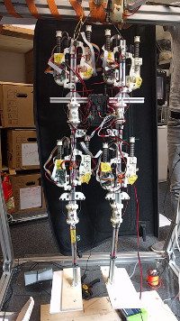

PaBiLegs
========

PaBiLegs Structure
------------------

The PaBiLegs consists of 4 joints and 8 motors, as every joint is moved by two motors (one in each direction). Angle sensors are built into each joint and allow us to know the position of the legs. A FPGA is used for the connection to the computer and communicates with the motors and joint angle sensors.

A force sensor within the motor allows to see how tight the spring tensed. This gives an insight into the force changes while other motors are actuating.

General Approach
----------------

The calibration procedure shall move the robot to an initial state, from which other programs can take over. This requires the following:

    
- A steady pose, that is always the same.

- The slot number of each motor and its position on the robot.

There are more slots in the FPGA than motors and motors might get connected to different slots from time to time. Calibration has to identify the motors and connect each two motors to the joints they are moving.

Calibration can be done in two ways:

Internal calibration
~~~~~~~~~~~~~~~~~~~~

The data about force changes and joint angle movement is enougth information to identify the parts and connect them in pairs of motors and a coherent angle.

This calibration procedure is currently in developement.

External calibration
~~~~~~~~~~~~~~~~~~~~

The robotics chair at TUM worked on a tendon-driven robot and calibration techniques with motion capture. The PaBiLegs can be tracked via `ArUco-markers <https://www.uco.es/investiga/grupos/ava/node/26>`_ or `lighthouse tracking <https://devanthro.atlassian.net/wiki/spaces/RM/pages/75635359/Lighthouse+Tracking>`_, so this paper could help with the calibration. As one can get the exact picture of the robot's movements with this technology, calibration will be more precise.

Important links for the PaBiLegs
--------------------------------

Getting started:

`Tutorial of how to control the PaBiLegs <https://devanthro.atlassian.net/wiki/spaces/CO/pages/75250222/Tutorial+of+how+to+control+the+PaBiLegs>`_

Github repositories:

`Github - roboy-ros-control <https://github.com/Roboy/roboy-ros-control>`_

`Github - myoFPGA <https://github.com/Roboy/myoFPGA/tree/feature/calibration>`_

Github repositories with updated code:

`Github - roboy-ros-control calibration <https://github.com/Persilisk/roboy-ros-control/tree/calibration>`_

`Github - roboy\_managing\_node calibration <https://github.com/Persilisk/roboy_managing_node>`_

Dancing code for the PaBiLegs:

http://roboy-error-detection.readthedocs.io/en/latest/1-familiarize-with-motors-and-joints

